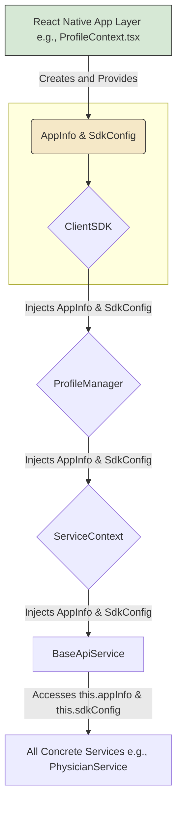
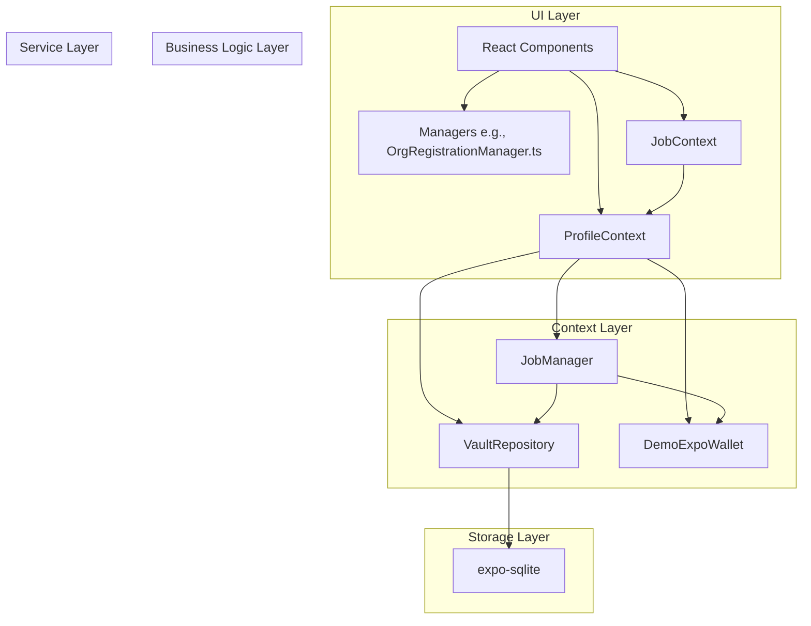
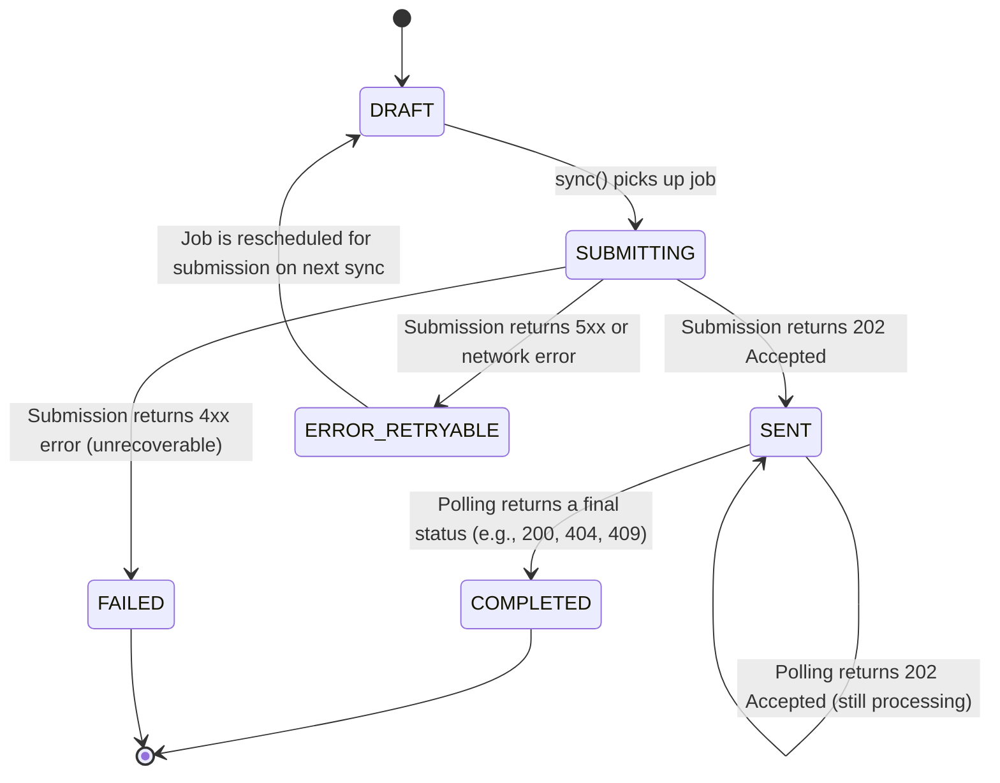
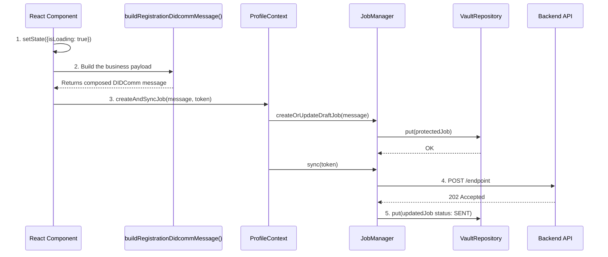

# SDK Architecture Overview

This document provides a high-level overview of the `client-sdk-ts` architecture, focusing on dependency injection, the service layer, and the capability mapping system.

## 1. Core Principle: Hexagonal Architecture & Bundled Trust Anchor

The SDK is designed around a hexagonal architecture. The core logic is platform-agnostic and relies on interfaces ("ports") for platform-specific functionality.

Crucially, the SDK's security model is anchored by a **Bundled Trust Anchor**. The application MUST be compiled with the raw public key of the ultimate Root Governing Body. This key is the foundation of the entire chain of trust and is **never** fetched from the network, eliminating the risk of sophisticated man-in-the-middle attacks.

The application layer (e.g., the Expo app) provides concrete implementations (the "adapters") for these interfaces. This allows the same SDK core to run in any environment (React Native, Angular, Node.js) simply by providing the appropriate adapters.

## 2. Dependency Injection Flow

Configuration and platform capabilities flow from the application layer down into the core of the SDK. This is a one-way data flow that ensures the core remains decoupled.



-   **`AppInfo`**: Contains static information about the running application instance.
-   **`SdkConfig`**: Contains the platform **adapters** and the **Root Governing Public Key** loaded from a secure environment variable.
-   **`ClientSDK`**: The main entry point. It accepts `AppInfo` and `SdkConfig`.
-   **`VerifierService`**: The core of the trust system. It is instantiated with the Root Public Key and uses it to verify the chain of trust for any credential. It operates **offline** for the root verification step.
-   **`ProfileManager`**: Represents a user session. It receives dependencies from the `ClientSDK`.
-   **`ServiceContext`**: A simple object that bundles all dependencies to be passed to services.
-   **`BaseApiService`**: The base class for all services, providing access to shared dependencies.

## 3. Service Layer Architecture: The Registry-Driven Engine

The service layer is built on a sophisticated model that maps a user's role and context to a dynamic set of capabilities. This is achieved through a registry-driven, dependency injection pattern.

### 3.1. Core Components & Concepts

- **Host vs. Gateway Providers:** The SDK's service resolution distinguishes between two entity types:
    - **Host Provider:** The central infrastructure provider, responsible for onboarding new organizations (`createOrganization`, `confirmOrder`).
    - **Gateway Provider (Tenant):** An individual organization that has been onboarded, managing its own day-to-day operations (`createEmployee`, `activateDevice`).

- **`roleRegistry.ts` (The Blueprint):** This file is the **Single Source of Truth** for all role definitions, mapping ISCO-08 codes to a `RoleDefinition` (the `serviceClass` and `capabilityServices` a role has).

- **Capability Services (The "Lego Bricks"):** Reusable, stateless services for a single function (e.g., `MedicationService`).

- **Role Services (The "Final Model"):** Represent a user's complete job (e.g., `PhysicianService`), composed of capabilities.

- **`capabilityMapper.ts` (The "Engine"):** A pure, agnostic function that reads the `roleRegistry` and dynamically instantiates and injects services to build the final API surface.

### 3.2. The Assembly Flow (The "Brain")

When a `ProfileManager` is created, it calls the `capabilityMapper` to build its API surface. The mapper performs the following steps:

```mermaid
graph TD
    A[ProfileManager calls capabilityMapper] --> B{1. Parse User Role};
    B -->|'ISCO-08|1120'| C(code = '1120');

    C --> D{2. Map Admin Role};
    D -->|context.appType = 'Organization'| E[Lookup '1120' in CONTEXT_ADMIN_REGISTRY];
    E --> F(Found OrgAdminService definition);
    F --> G[Instantiate OrgAdminService];

    C --> H{3. Map Professional Role};
    H -->|context.appInfo.sector = 'health-care'| I[Lookup '1120' in SECTOR_ROLE_REGISTRY for 'health-care'];
    I --> J(No definition found for '1120');

    G & J --> K{4. Assemble Namespaces};
    K -->|{ orgAdmin: { admin: OrgAdminService } }| L[Return to ProfileManager];

    style A fill:#D6E8D5,stroke:#333
    style L fill:#F5E8C7,stroke:#333
```
This architecture ensures that all logic is centralized in the registries, making the system easy to extend and maintain. To give a `Physician` a new capability, only the `roleRegistry.ts` file needs to be modified.
# Application Architecture

This document outlines the core architectural principles of this application, focusing on dependency management, separation of concerns, and the flow of data. Adhering to these principles is crucial for maintaining a scalable, testable, and secure codebase.

## 1. Core Principles

- **Context-Based Dependency Injection**: The application uses React Context as its primary mechanism for dependency injection. This avoids prop-drilling and keeps UI components clean of service instantiation logic.
- **Hierarchical Service Ownership**: There is a clear hierarchy for ownership of core services. Higher-level contexts own and provide services to lower-level, more specialized contexts.
- **Managers are Pure Functions**: Whenever possible, `Manager` files should export pure functions that encapsulate business logic. They transform data and should be stateless and dependency-free, making them highly testable.
- **UI Components are Orchestrators**: The UI's role is to orchestrate the flow between user actions, business logic (Managers), and service capabilities (Contexts). It should not contain complex business logic or instantiate services.

---

## 2. "SDK-First" Architecture & The Service Factory

The application is designed as if it were shipping a core, platform-agnostic Software Development Kit (SDK) that is consumed by a thin, platform-specific Application Shell. This is achieved through a **Service Factory** pattern.

### The Core SDK (`@your-org/core-sdk`)
Contains all reusable, platform-agnostic business logic.
- **Contents**: `JobManager`, `crypto-ts`, all interfaces (`IWallet`, `IVaultRepository`), all data models.
- **Key Rule**: Depends only on interfaces, never concrete implementations. Marked with `@sdk`.

### The Application Shell (The "App")
Contains all platform-specific "glue" code and UI.
- **Contents**: All React components, contexts, and concrete interface implementations (`ExpoWallet`, `VaultRepository.native.js`, `VaultRepository.web.js`). Marked with `@app`.

### The Bridge: `platformServices.ts` (Service Factory)
This file is the **only place** in the application where concrete implementations are instantiated. It uses dynamic, platform-aware `require` statements to ensure the correct module is loaded for web and native.

- **Responsibility**: To read the environment (`OPERATION_MODE`) and instantiate the correct services (`ExpoWallet` for production, `DemoExpoWallet` for demo).
- **Mechanism**: It exports pre-instantiated singleton instances (`appWallet`, `appVault`) that conform to the SDK interfaces.

```typescript
// platformServices.ts - Simplified Example

import { Platform } from 'react-native';
// ... other imports

function createVault(): IVaultRepository {
  let VaultRepository;
  if (Platform.OS === 'web') {
    VaultRepository = require('./database/VaultRepository.web').default;
  } else {
    VaultRepository = require('./database/VaultRepository.native').default;
  }
  return new VaultRepository();
}

export const appVault = createVault();
```

### The Composition Root: `App.tsx`
This is the top-level entry point of the React application.
- **Responsibility**: To import the `appWallet` and `appVault` from the service factory and pass them as props to the `ProfileProvider`. This act of **Dependency Injection** makes the services available to the rest of the app via the `useProfile` hook, without any other component needing to know about the concrete implementations.

---

## 3. The 5 Layers of the Architecture

The system is divided into five decoupled layers. This design ensures a clean separation of concerns, creating a robust and secure client-side infrastructure.



### Layer 1: Storage (`VaultRepository`)
- **Responsibility**: To persist data securely. It has zero knowledge of the plaintext content it saves.
- **Technology**: `expo-sqlite` provides the underlying database, which the `VaultRepository` uses to store encrypted records.

### Layer 2: Crypto (`DemoExpoWallet`)
- **Responsibility**: To handle all cryptographic operations. **It never exposes keys.** It acts as an "oracle" to `protect` (encrypt) and `unprotect` (decrypt) data.

### Layer 3: Context & Services (`ProfileContext`, `JobManager`)
- **`ProfileContext` (The Root Service Provider)**:
    - **Owner of**: `wallet`, `vault`, and `JobManager`. These are the fundamental services tied to a user's profile.
    - **Responsibilities**: Instantiates and manages the lifecycle of these services. Provides **high-level, generic capabilities** that use these services (e.g., `createAndSyncJob`).
- **`JobManager` (The Orchestrator)**:
    - **Responsibility**: Contains all business logic for a job's *delivery* lifecycle. It coordinates the Wallet and the Vault to submit jobs and poll for results. It is a generic workhorse with no knowledge of specific job types.

### Layer 4: Specialized Contexts (`JobContext`)
- **`JobContext` (Specialized Data Provider)**:
    - **Responsibility**: To provide a live, filtered view of data to the UI.
    - **Functionality**: It **consumes** the `ProfileContext` to get the `jobManager` instance and uses it to provide a real-time list of all jobs. It **does not instantiate any services.**

### Layer 5: UI & Business Logic
- **UI Components (`screens/*.tsx`)**:
    - **Responsibility**: To orchestrate the flow. A screen gathers user input, calls a Business Logic function to build a payload, and then calls a capability from the `ProfileContext` to submit it.
- **Business Logic (`managers/*.ts`)**:
    - **Responsibility**: To encapsulate the complex rules for creating a specific type of data payload. Exported as **pure functions** (e.g., `buildRegistrationDidcommMessage`).

---

## 3. The Job Lifecycle & State Machine

This state machine describes the lifecycle of a `JobRequest` object, focusing purely on its **delivery status**. The final business outcome is stored in a separate, linked response message.



- **`DRAFT`**: The job has been created locally but not yet submitted.
- **`SUBMITTING`**: The `JobManager` is actively trying to send the job.
- **`SENT`**: The server has accepted the job (`202 Accepted`) and is processing it asynchronously.
- **`COMPLETED`**: The server has finished processing. A final response has been received and stored separately, linked via `responseMessageId`. This is a terminal state.
- **`FAILED`**: An unrecoverable transport-level error occurred (e.g., `401 Unauthorized`). The job will not be retried.
- **`ERROR_RETRYABLE`**: A transient error occurred (e.g., `503 Service Unavailable`). The job will be picked up again by the `sync()` process.

---

## 4. The Job Data Model (`ConfidentialStorageDoc`)

A record in the `VaultRepository` maps directly to the `JobRequest` interface.

```typescript
// A record in the vault, representing a Job.
// This is the "envelope" for the secure message.
export interface JobRequest {
    // --- UNENCRYPTED ROOT PROPERTIES (THE "ENVELOPE") ---
    // These fields are used by the JobManager to manage the job's lifecycle
    // without needing to decrypt the payload.

    /** A stable, unique primary key for the local database record (e.g., a UUID). */
    id: string;
    
    /** A hash of the entire `content` object. Changes if the content changes. For integrity and versioning. */
    versionId?: string;
    
    status: JobStatus;   // The current state of the job in its lifecycle.
    vaultId?: string;    // The ID of the profile that owns this job.
    sequence: number;    // A version number for the vault record itself.
    
    // --- OPTIONAL UNENCRYPTED FIELDS ---
    locationUrl?: string;     // The URL for polling, received after submission.
    errorMessage?: string;    // For debugging, stores the last transport/processing error.
    retryCount?: number;      // A counter for retry attempts.
    responseMessageId?: string; // The `id` of the saved response message, once COMPLETED.

    // --- SENSITIVE DATA (ENCRYPTED AT REST) ---

    /** 
     * The sensitive DIDComm message (the "letter"). This entire object is encrypted at rest.
     * When stored, this property is removed and replaced by a `jwe` property.
     */
    content?: IDecodedDidcommPayload;

    /** 
     * The JWE representation of the encrypted `content`. This is what is actually stored.
     */
    jwe?: Record<string, any>;

    /** 
     * HMAC-protected attributes for blind queries. Sensitive fields needed for
     * searching (like `thid`) must be stored here, not at the root.
     */
    indexed?: IndexedData;
}

/**
 * The "letter" inside the envelope. This is the plaintext of the DIDComm message.
 */
export interface IIDecodedDidcommPayload {
  // --- FAPI & JWT Core Claims (Security & Routing) ---
  iss: string;  // (Issuer) The DID of the entity that issued the message.
  aud: string;   // (Audience) The URL of the backend endpoint.
  
  /**
   * (JWT ID) A unique identifier for this message/token. Can be used to prevent replay attacks.
   * In this architecture, it can be the version hash of the data content.
   */
  jti: string;
  exp: number;  // (Expiration Time)
  nbf: number;  // (Not Before)

  // --- DIDComm Core Fields (Correlation & Messaging) ---
  /** (Thread ID) A unique identifier for the message thread (e.g., a UUID). */
  thid: string;
  pthid?: string; // (Parent Thread ID) for session correlation.
  to?: string[];  // Recipient DIDs.
  from?: string;  // Sender DID.

  // --- Business Payload ---
  type: string;  // The type of the body (e.g. 'application/json' or protocol URI)
  body: any;     // The business-specific payload.
}
```

### 4.1. Data Structures: `ConfidentialStorageDoc` vs. `Resource Object`

The application uses two primary data structures. It is critical to understand their distinct purposes.

**1. The `ConfidentialStorageDoc` (The "Envelope")**

-   **Purpose:** Represents a complete, storable entity for **persistence in the Vault** (e.g., a `Job`, a saved `Contact`).
-   **Defining Feature:** Has a top-level `content` property. This property holds the entire payload that is encrypted into the `jwe` property for at-rest storage.
-   **Example:** `{ id, thid, status, content: { ... } }` which becomes `{ id, thid, status, jwe: { ... } }` in the vault.

**2. The `Resource Object` (The "Content of the Letter")**

-   **Purpose:** Represents a single, granular piece of business data, often analogous to a FHIR Resource or a JSON:API Resource Object. They are used for **in-memory operations** (e.g., in the `DirectoryManager` cache) and as entries within the `body.data` of a `ConfidentialStorageDoc`.
-   **Defining Feature:** Has a `meta.claims` object at its root. This object is the single source of truth for its plaintext business data, using reverse-DNS claim names. **It does not have a `content` property.**
-   **Example:** `{ id: '...', type: 'RelatedPerson', meta: { claims: { 'org.hl7.fhir.api.RelatedPerson.role': 'ECON' } } }`.

These two structures must not be confused. A `ConfidentialStorageDoc` *contains* one or more `Resource Objects` within its `content.body.data` array, but a `Resource Object` stands alone when held in memory.

---

### 4.2. Data At-Rest vs. In-Transit: A Core Principle

It is critical to distinguish between the data model for local storage (`at-rest`) and the model for network communication (`in-transit`). This `ConfidentialStorageDoc` defines the **at-rest** model.

-   **`jwe` (Encrypted Content)**: The sensitive `content` of a job is encrypted into a JWE object intended for secure local storage. It is **not** a Compact JWE used for network transit.
-   **`indexed` (Protected Queryable Attributes)**: This array holds deterministically protected attributes (e.g., via HMAC). This allows the application to perform secure, privacy-preserving queries on sensitive data without decrypting the `jwe` payload.

---

## 6. End-to-End Secure Flow: Response Handling

Just as requests are packed for security, responses from the server must be unpacked and verified. This is the responsibility of the `IWallet` interface.

### The `IWallet.unpack()` Method

- **Responsibility**: To take a raw HTTP response body and return the plaintext business content. This method is the single entry point for handling secure responses.
- **Implementation**:
    1.  The `JobManager` blindly passes the entire raw response body from a poll to `wallet.unpack()`.
    2.  The `unpack` implementation is responsible for determining the response format (e.g., by checking for a `response=` parameter for FAPI JARM, or by attempting to parse as a JWE/JWS).
    3.  It orchestrates the necessary cryptographic steps:
        -   **JWE Decryption**: It calls the low-level crypto service to decrypt the JWE payload.
        -   **JWS Signature Validation**: It **must** then validate the signature of the nested JWS payload to ensure the authenticity and integrity of the response.
        -   **Payload Parsing**: It uses low-level utilities (like a `decodePayload` function) to parse the final plaintext from the verified JWS.
    4.  It returns the final, verified plaintext content to the `JobManager`.

This ensures the `JobManager` remains a clean orchestrator, while the `Wallet` correctly encapsulates all complex, security-critical decoding and verification logic.

---

## 7. Security & Best Practices

### 7.1. Handling Session Identifiers (`pthid`)

A session identifier (`sid`) from an identity provider is a sensitive credential. It should be used as the Parent Thread ID (`pthid`) to link all jobs within a session.

**Security Mandate**: The `pthid` **must not** be stored as a plaintext root property. It must be treated as a sensitive, queryable attribute and stored inside the `indexed` array. This protects the session from compromise if the local storage is exposed, while still allowing the application to query for all jobs related to a session.

### 7.2. Replay Attack Prevention

The system prevents replay attacks by ensuring every job has a unique **`thid`** (Thread ID). The backend is responsible for tracking all received `thid` values and rejecting any duplicates. This makes a separate `nonce` field unnecessary.

---

### 7.3. The "_batch" Service Philosophy

Services with a `_batch` suffix (e.g., `v1_health-care_individual_org.schema_Person_batch`) have a specific meaning in this architecture. A batch job is designed to aggregate multiple entries for a **single subject** or transaction.

For example, when onboarding a new customer, the `_batch` service is used to:
1.  Submit the initial registration with signed Terms of Service.
2.  Later, submit a verified identity document (like a passport scan) for the *same* customer.
3.  Later still, submit a Verifiable Credential for the *same* customer.

This pattern is **not** for processing multiple different users in a single call. It is for building a complete record for one individual over multiple interactions.

---

## 5. The Correct UI Orchestration Flow

This is the complete, non-blocking lifecycle of a job, from user click to the final UI update. This two-step pattern **must** be followed in UI components.



1.  **Gather Data**: The screen collects data from forms.
2.  **Build Payload**: The screen calls a pure `Manager` function (e.g., `buildRegistrationDidcommMessage`) to construct the specific DIDComm message.
3.  **Submit Generically**: The screen calls the generic `createAndSyncJob` function from the `useProfile` hook, passing in the message and the required auth token.
4.  **Background Processing**: The `JobManager`, owned by the `ProfileContext`, handles the rest of the lifecycle (submission, polling, completion) in the background.
