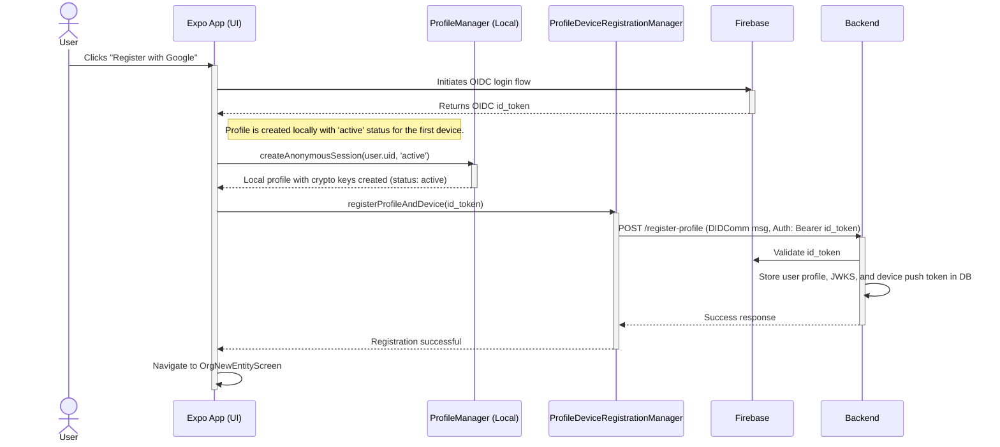
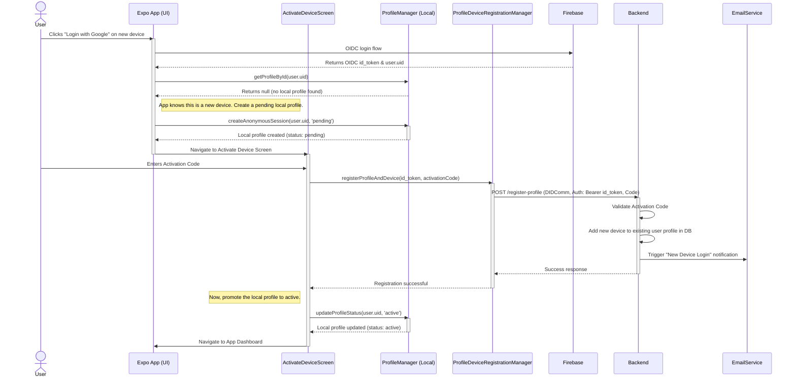

# System Architecture: User Flows and Device Registration

This document outlines the architectural design for user authentication, profile creation, and device registration. It employs a modern, secure, and identity-centric approach by combining standard OIDC for user authentication with a DIDComm-based, DCR-like pattern for cryptographic profile and device registration.

## Components Overview

-   **Expo App (Client)**: The user-facing application. Manages stateful local cryptographic profiles (`ProfileManager`, with `status: 'pending' | 'active'`) and orchestrates registration flows (`ProfileDeviceRegistrationManager`).
-   **Firebase Authentication**: The trusted third-party Identity Provider (IdP) for authenticating users via Google, Apple, etc., using the OpenID Connect (OIDC) standard.
-   **Backend API**: The custom server that manages user profiles, devices, and business logic. It trusts Firebase as the OIDC provider.
-   **Database**: The persistent storage for the Backend API, containing user profiles, public keys, and registered device information (e.g., push tokens).
-   **Email Service**: An external service (e.g., SendGrid, AWS SES) triggered by the backend to send security notifications.

---

## Flow 1: New User & First Device Registration

This flow is for a new user creating their account and registering their first device. The process is seamless and does not require an activation code, as the registration of the organization serves as implicit activation. The local profile is created directly with an `'active'` status.

---

## Flow 2: Existing User Login & New Device Activation

This flow describes a returning user logging in from a new, unrecognized device. This is a security-critical path that requires explicit device activation to proceed. The local profile is initially created in a `'pending'` state until activation is complete.

## Security Model

### New Device Login Notifications
As detailed in Flow 2, the backend **must** send an email notification to the user's registered email address whenever a new device is registered to their profile. This is a critical security measure.

### Device Activation Codes
The device activation step is a core part of the security model for existing users.
1.  A user attempts to log in from an unrecognized device.
2.  A local profile is created with a `'pending'` status. This prevents the user from accessing the main app until activation is complete.
3.  The user is forced to navigate to the `ActivateDeviceScreen`.
4.  The user must provide a valid activation code to proceed.
5.  Upon successful registration with the backend, the local profile's status is promoted to `'active'`.
This provides granular control over which devices can be associated with a professional's profile. For the initial implementation, the backend may accept an empty or default code, but the client-side flow is already in place.
