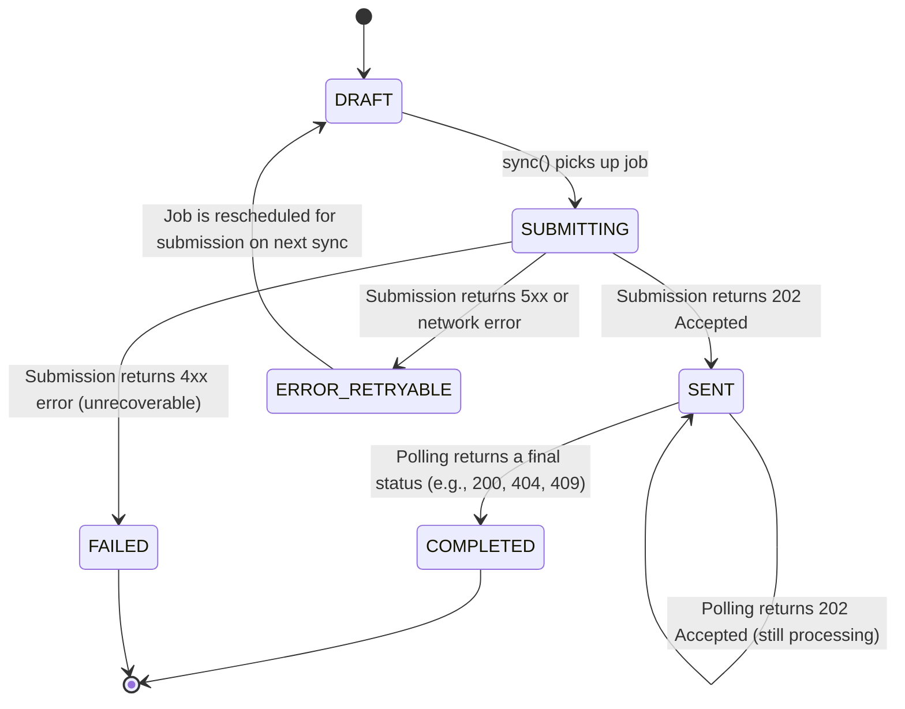
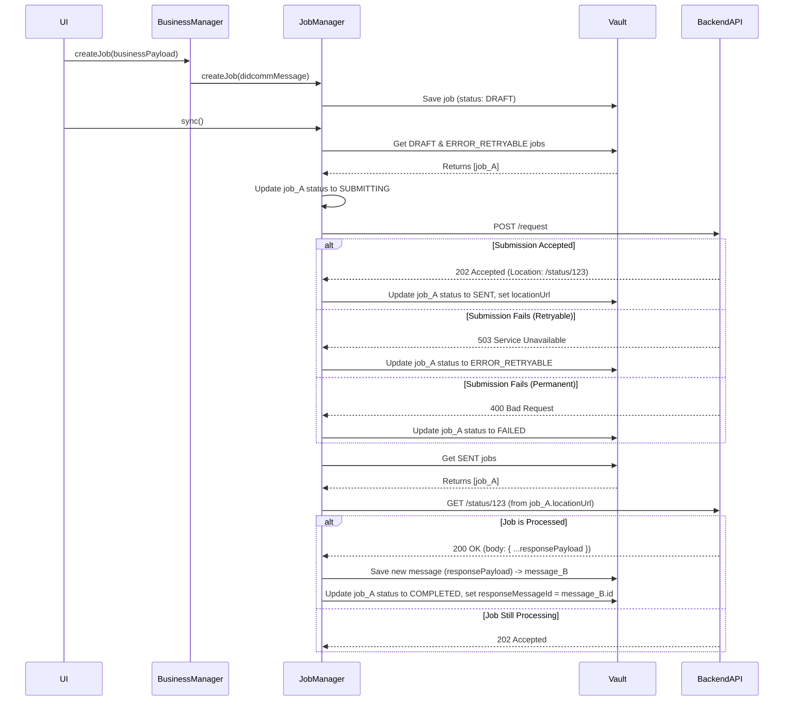

# FAPI-Compliant Asynchronous Job Architecture

This document specifies the architecture for creating and submitting secure, asynchronous jobs, adhering to modern security patterns like FAPI (Financial-grade API) and OAuth 2.0. This flow supersedes simpler, traditional client-server submission models.

## 1. Core Principles

- **Separation of Concerns:** The creation of a job's business content is separate from the act of its secure submission.
- **Immediate Sealing:** Security artifacts, like the `id_token` from an identity provider, are "sealed" into the job at the moment of creation. This makes the job a self-contained, auditable record of the submission *intent*.
- **Short-Lived Jobs:** Every job intended for submission contains an `exp` (expiration) timestamp. Following FAPI best practices, this lifetime is very short (**60 seconds**) and is independent of the `id_token`'s expiration. This minimizes the attack window for the submission intent.
- **Request by Reference (`request_uri`):** The client does not send large, sensitive payloads directly to the target API endpoint. Instead, it uploads the secure payload (JWE/JWS) to an **intermediary blob storage (e.g., Google Cloud Storage, AWS S3)** and sends only a reference (`request_uri`) to the endpoint. This is crucial for handling payloads that may exceed API gateway limits (e.g., PDFs).

## 2. Architecture: Job Delivery vs. Business Outcome

A critical architectural principle is the separation between the **job's delivery status** and the **final business outcome**.

- **`JobRequest` Object**: Represents an **outgoing request**. Its lifecycle (DRAFT -> SUBMITTING -> SENT -> COMPLETED) is concerned only with the reliable delivery of that request to the server. Its terminal state, `COMPLETED`, signifies that the server has processed the request and returned a final response. It **does not** store the response body.
- **Response Message**: The final response from the server (e.g., a FHIR OperationOutcome) is treated as a **new, separate message**. It is stored independently in the vault's `'messages'` collection.
- **Linking**: The original `JobRequest` object is linked to its response via the `responseMessageId` field. This maintains a clean, normalized data model.

This separation allows higher-level business logic to act on the result of a job (e.g., parsing a complex FHIR Bundle with multiple success/error entries) without overloading the `JobManager`'s responsibility, which is simply guaranteed delivery.

## 3. The Job Lifecycle & State Machine (Revised)

This state machine describes the lifecycle of the `JobRequest` object, focusing purely on its delivery status.

- **`DRAFT`**: The job has been created locally but not yet submitted.
- **`SUBMITTING`**: The `JobManager` is actively trying to send the job.
- **`SENT`**: The server has accepted the job (`202 Accepted`) and is processing it asynchronously.
- **`COMPLETED`**: The server has finished processing. A final response has been received and stored separately. This is a terminal state for the job's delivery lifecycle.
- **`FAILED`**: An unrecoverable transport-level error occurred (e.g., `401 Unauthorized`). The job will not be retried.
- **`ERROR_RETRYABLE`**: A transient error occurred (e.g., `503 Service Unavailable`, network timeout). The job will be picked up again by the `sync()` process.

## 4. Detailed Component Interaction Flow (Mermaid)

This diagram illustrates the complete, end-to-end process, including the creation of the separate response message.

## 5. Component Responsibilities (Revised)

### `OrgRegisterRepresentativeScreen` (UI Layer)
- **Responsibility:** Collect data, orchestrate the high-level flow.
- **Logic:**
    1. On "Submit", it first gets a fresh `id_token` from Firebase Auth.
    2. It calls `OrgRegistrationManager.createRegistrationJob()`, passing the form data and the `id_token`.
    3. After `createRegistrationJob` completes, it then calls `jobManager.sync()`. This separation is critical.

### `OrgRegistrationManager` (Business Logic Layer)
- **Responsibility:** Translate UI data into a "sealed" job object.
- **`createRegistrationJob(finalClaims, idToken)`:**
    1. Calls `jobManager.createJob()` with only the business `body`.
    2. Receives the basic `draft` job.
    3. **"Seals" the job:**
        - Adds `job.content.meta.bearer.compact = idToken`.
        - Adds a new top-level `job.exp` property, setting it to `Date.now() + 60_000` (60 seconds), compliant with FAPI recommendations.
    4. Saves the updated, "sealed" job back to the `Vault`.

### `JobManager` (Service & Submission Layer)
- **`createJob(body)`:** A simple factory. Its only job is to create a barebones `draft` job with a `jti`, `thid`, and the business `body`. It does not know about security tokens.

- **`sync()`:**
    1. Fetches all jobs in `draft` status.
    2. For each job, it performs the **expiration check**: `if (job.exp < Date.now())`. If expired, moves it to the `error` state.
    3. If valid, proceeds to call `_submitJob(job)`.

- **`_submitJob(job)`:**
    1. Sets the job status to `SUBMITTING`.
    2. Sends the job payload to the backend.
    3. On `202 Accepted`, updates status to `SENT` and stores the `locationUrl`.
    4. On `5xx` or network errors, updates status to `ERROR_RETRYABLE`.
    5. On `4xx` errors, updates status to `FAILED`.

- **`_pollSentJobs()`**:
    1. For each `SENT` job, polls the `locationUrl`.
    2. If the response is `200 OK` or a `4xx` code, it treats this as a final business outcome.
    3. It saves the response body as a **new message** in the vault's `'messages'` collection.
    4. It updates the original job's status to `COMPLETED` and sets the `responseMessageId` to link to the new response message.
    5. If the response is `202 Accepted`, it does nothing and waits for the next poll.

## 6. Metadata and Standardization

### Blob Storage Metadata (e.g., `Content-Length`)

The size of the payload is not stored within the job's `meta` property. Instead, we rely on standard blob storage mechanisms.

- **Purpose:** When the JWE/JWS payload is uploaded to the blob storage, the storage provider (e.g., AWS S3, GCS) automatically calculates its size and stores it as metadata, typically accessible via the `Content-Length` HTTP header.
- **Backend Implementation:** The backend can efficiently check the size of the payload by making a lightweight `HEAD` request to the `request_uri` before deciding to download the full object. This prevents the server from consuming excessive resources on unexpectedly large files.

### `exp` Property

The top-level `job.exp` property defines the lifetime of the *submission intent*.

- **Rationale:** An `id_token` may be valid for an hour, but the intent to perform a specific, sensitive action should be extremely short-lived.
- **Implementation:** We set this to **60 seconds** from the moment the job is sealed. The `JobManager` **must** check this field before attempting submission to prevent sending requests with stale authorization. This is a critical FAPI security pattern.
