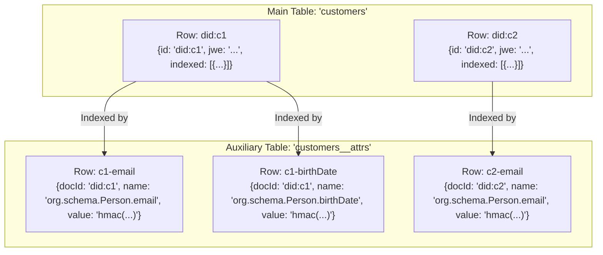

# VaultRepository Architecture for Indexed Queries

This document outlines the correct architecture for the `VaultRepository` to handle queries on both top-level properties and nested `indexed` attributes, specifically within the limitations of the TinyBase library.

### 1. The Core Problem

TinyBase is a simple, key-value based data store. It **cannot** efficiently query for values inside complex objects or arrays stored within a single cell (like our `indexed` array). A full-table scan, where we load every single document and check its `indexed` array in JavaScript, is inefficient and does not scale.

### 2. The Correct Architecture: Attribute Table Indexing

The standard and robust solution is to use a database pattern called an **Attribute-Value Table**. For each main table (e.g., `customers`), we create a corresponding auxiliary table (e.g., `customers__attrs`) dedicated solely to indexing.

This results in the following structure:

### 3. Data Flow

#### `put(tableName, doc)` Operation

1.  The complete document `doc` (with its original `indexed` array) is saved into the main table (e.g., `customers`). This table acts as the **source of truth**.
2.  The system then deletes any pre-existing rows from the auxiliary table (e.g., `customers__attrs`) that are associated with `doc.id`. This handles updates correctly.
3.  The system iterates through the `doc.indexed` array. For each `{ name, value }` pair, it inserts a new row into the `customers__attrs` table with the structure `{ docId, name, value }`.

#### `query(tableName, { where })` Operation

1.  Initialize a set of potential document IDs, `candidateIds`. Start with all IDs from the main table.
2.  Loop through each condition in the `where` clause.
3.  For each condition:
    *   **If it's a top-level property** (e.g., `status: 'draft'`): Filter the `candidateIds` by checking the documents in the main table.
    *   **If it's an indexed attribute** (e.g., `email: '...'`):
        1.  Search the **auxiliary `__attrs` table** for all rows that match the condition's `name` and `value`.
        2.  Collect the `docId`s from these matching rows.
        3.  Perform an **intersection** between the current `candidateIds` and the `docId`s found in this step. The result becomes the new `candidateIds`.
4.  After iterating through all conditions, the `candidateIds` set contains the IDs of only those documents that match **all** conditions.
5.  Retrieve the full documents from the main table using the final `candidateIds`.

This architecture is robust, scalable, and correctly uses the strengths of a key-value store to enable complex queries.
