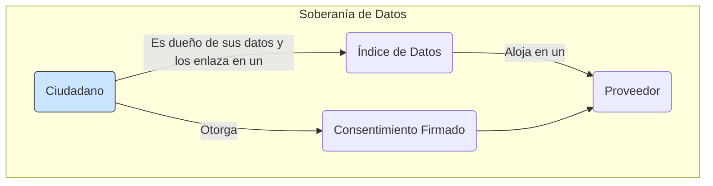
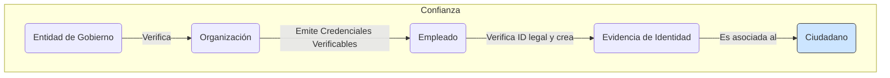
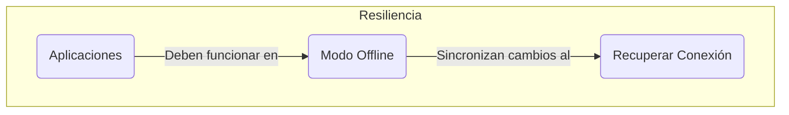
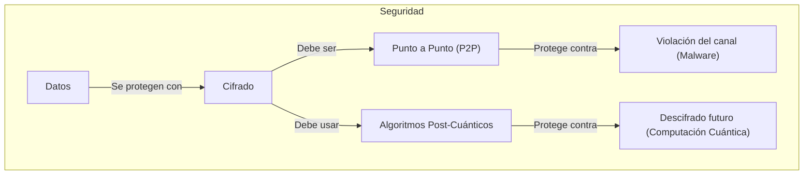
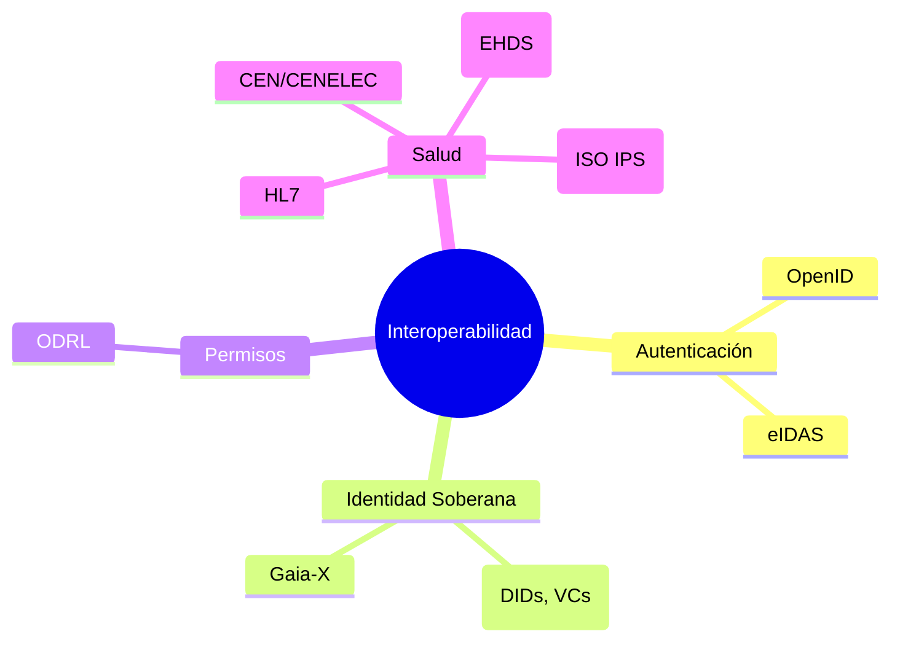
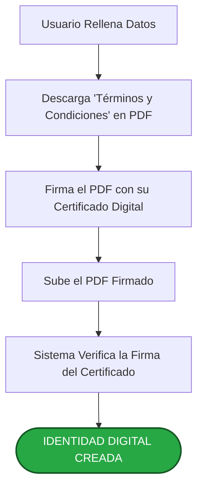

Espacio de Datos: Global-DataCare

# 1. Introducción

El espacio de datos se construye sobre cinco pilares o principios fundamentales:

1. Soberanía de datos y accesibilidad: el individuo (ciudadano) es el dueño de sus datos y dispone de sus datos enlazados en un índice de datos, que aloja en un proveedor mediante un consentimiento firmado.

La persona no necesita una aplicación de software ni conocimientos de informática (inclusividad), ya que el consentimiento puede ser firmado manualmente y entregado presencialmente en una organazión miembro del espacio de datos, que verificará la identidad de la persona firmante con un documento de identidad válido. El consentimeinto puede incluir también permisos de acceso (pre-autorizaciones) para emergencias, continuidad asistencial e investigación.



1. Confianza: la organizaciones son verificadas por 
las entidades de gobierno del espacio de datos antes de formar parte de él. Ellas crean las credenciales verificables para los roles de sus empleados. Los empleados crean evidencias de identidad de los individuos (cuidadanos) tras verificar un documento de identidad legal.



3. Resiliencia: el sector de salud es un sector crítico para la defensa de los países. Las aplicaciones que conectan con el espacio de datos tienen funcionar en modo offline (sin conexión a internet) y sincronizar los cambios una vez se recupere la conexión.



4. Seguridad: los implantes de malware avanzados como Turla y Snake violan la seguridad de HTTPS y otros protocolos. No puede confiarse en la seguridad del canal, por lo que las comunicaciones de datos tienen que estar cifradas punto a punto (P2P) entre el emisor y los receptores. Además tienen que utilizar algoritmos resistentes a computadores cuánticos, para evitar que los datos espiados mediante implantes de malware puedan ser descifrados en unos años.



5. Interoperabilidad: los estándares de autenticación de usuarios desarrollados por OpenID y adoptados por eIDAS, así como los desarrollados por W3C sobre identidad digital autosoberana (documento DID, credentiales y presentaciones verificables) y adoptados por Gaia-x, los estándares para permisos de ODRL, y los estándares de salud desarrollados por HL7 y CEN/CENELEC como International Patient Summary (ISO IPS), son otro de los pilares fundamentales del espacio de datos.



La arquitectura desarrollada, por tanto, se alinea con los principios europeos de identidad soberana (SSI), los estándares como **eIDAS** y del Espacio de Datos de Salud Europeo (EEDS), sentando las bases para una interoperabilidad futura y un ecosistema de confianza digital.


---

## 2. Nacimiento de la identidad digital

Todo comienza con la creación de la identidad digital de un usuario (un representante de una organización o un ciudadano). Para ello, el usuario debe demostrar quién es a través de un proceso de registro inicial seguro. Ofrecemos dos vías para organizaciones y tres vías para las personas particulares, equilibrando la máxima seguridad con la accesibilidad.

### Opción A: Máxima Seguridad (Firma con Certificado Digital)

Este es el método más robusto, análogo a **firmar un contrato ante notario en el mundo digital**.

*   **¿Cómo funciona?**: El usuario utiliza un certificado digital emitido por una autoridad de confianza (como los que se usan en muchos DNI electrónicos europeos) para firmar digitalmente el documento de "Términos y Condiciones".
*   **¿Qué garantiza?**: Esta firma tiene validez legal y ofrece una prueba irrefutable de la identidad del usuario en ese momento.

**Esquema del Flujo A:**



### Opción B: Máxima Accesibilidad (Firma con Código de Verificación)

Este método es más accesible, similar a **confirmar una operación bancaria online con un código que se recibe en el teléfono móvil**.

*   **¿Cómo funciona?**: Como la seguridad inicial es menor que la de un certificado, pedimos al usuario que proporcione más datos de identificación (nombre, apellidos, tipo de documento, número de documento, etc.). Luego, enviamos un código de un solo uso (OTP) a su email para verificar que tiene control sobre esa dirección.
*   **¿Qué garantiza?**: Asegura que la persona que se registra tiene el control del email y ha aportado documentos de identidad que se pueden verificar posteriormente.

**Esquema del Flujo B:**

```
1. Usuario Rellena Datos (Email, Nombre, Documento de Identidad, etc.)
   |
   +-> 2. El Sistema envía un Código de un solo uso al Email
       |
       +-> 3. Usuario Introduce el Código en la Aplicación
           |
           +-> 4. Sistema Verifica el Código
               |
               +-> [IDENTIDAD DIGITAL CREADA]
```

---

## 3. Componentes clave de la "Identidad Digital"

Una vez completado el registro, el sistema crea dos elementos fundamentales para el usuario:

### a) El Identificador Global Unificado para Salud

Pensemos en el Identificador Global Unificado como una **dirección de confianza en internet, pública y que solo el usuario controla**. Es como un número de teléfono o un email, pero descentralizado y mucho más seguro.

*   **No depende de ninguna empresa**: El usuario es el dueño de su identificador. Puede cambiarlo (alojarlo) en un proveedor u otro siempre que quiera.
*   **Es verificable**: Permite a otros encontrar las "claves públicas" del usuario para comunicarse de forma segura, así como las evidencias de identidad física que se han asociado con el identificador.
*   **Es la base de la cadena de confianza**: Repreenta el ancla sobre la que se construirán las comunicaciones digitales y los permisos de acceso a datos.
   
Este identificador permite recuperar el documento DID (documento de identidad digital descentralizado) y las credenciales verificables del usuario desde el proveedor en el que está alojado.

Ejemplo:
```
did:web:api.proveedor.org:individual:multibase:z(UUID-Base58)
```

Este sistema, de forma simplificada, permite cambiar una identidad digital tradicional (certificado digital en formato X.509 emitido por la una entidad de confianza como la FNMT) u otras (por ejemplo, credencial eIDAS) por una identidad digital descentralizada y global para salud, que incorpora algoritmos resistentes a computación cuántica, permite evitar fraudes y facilitar a la persona el manejo y actualización automática de su índice unfiicado de datos para emergencias y continuidad asistencial, utilizando únicamente el consentimiento firmado de la persona.

Todo esto se realiza en cumplimiento de los más altos estándares de seguridad de la información, y de las normativas europeas de accesibilidad, portabilidad y protección de datos.

### b) Las Credenciales Verificables (VCs)

Pensemos en las VCs como los **"certificados" o "carnés" digitales que el usuario puede obtener y guardar en su cartera digital**. Son declaraciones de datos (claims) firmadas digitalmente por una entidad.

*   **Ejemplos para un Profesional**: "Soy empleado de la Organización Acme", "Mi cargo es Director", o bien "Trabajo como profesional sanitario o como administrativo/a en dicha organización", y dispongo un email y un código de ocupación estandarizado en mi credencial de empleado.
*   **Ejemplos para un Ciudadano**: "Soy mayor de edad", "Puedo demostrar que poseo el número de un identificador legal, porque fue verificado por entidades de confianza", "Puedo demostrar cuál es mi nombre y apellidos, porque fueron verificados por parte de entidades de confianza mediante un identificador legal que poseo". "Puedo demostrar que soy familiar o tutor legal de otro individuo y el tipo de relación, porque fue verificada por una entidad de confianza".

**Esquema de la Identidad Digital:**

```
+--------------------------------+
|      IDENTIDAD DIGITAL         |
|      (Controlada por el Usuario)|
|--------------------------------|
|                                |
|   IDENTIFICADOR ÚNICO (DID)    |
|   (Tu "Dirección" Pública)     |
|                                |
|   +--------------------------+ |
|   | CREDENCIALES (VCs)       | |
|   | (Tus "Carnés" Digitales) | |
|   +--------------------------+ |
|                                |
+--------------------------------+
```

---

## 4. Seguridad en Cada Operación: El Modelo de la "Triple Cerradura"

Una vez que el usuario tiene su identidad, cada acción que realiza en el espacio de datos (desde crear un grupo de profesionales o familiares hasta firmar un documento) debe ser segura. Un atacante no debe poder generar una acción en un descuido mío y utilizarla en el futuro.

Para evitarlo, cada comunicación utiliza un sistema de "Triple Cerradura", inspirado en los más altos estándares de seguridad (como Financial API o FAPI).

### Cerradura 1: La "Entrada de un Día" (Autenticación Reciente)

Antes de hacer nada, el usuario debe iniciar sesión en un proveedor de identidad. Puede ser el que tenga su organización o bien otro que esté soportado y reconocido por el servicio de gateway o pasarela del espacio de datos (por ejemplo: eIDAS, Google ID, Apple ID). Al hacerlo, obtiene un **"token de sesión"**, que es como una entrada para un evento que caduca pronto (ej. en 15 minutos).

*   **Propósito**: Asegura que el usuario se ha identificado **recientemente**.

### Cerradura 2: El "Sello Personal" (Firma de la Petición)

Cada mensaje que envía la aplicación del usuario lleva su **firma digital privada** como empleado o a nivel personal.

*   **Propósito**: Garantiza dos cosas:
    1.  **Autenticidad**: El mensaje solo pudo haber sido creado por el usuario.
    2.  **Integridad**: El contenido del mensaje no ha sido modificado en el camino.

### Cerradura 3: El "Sobre de Seguridad" (Cifrado de la Petición)

Finalmente, todo el mensaje firmado se introduce en un **"sobre digital" que se sella**. Solo el destinatario (el servicio gateway o pasarela del espacio de datos) tiene la llave para abrirlo.

*   **Propósito**: Garantiza la **confidencialidad**. Nadie que intercepte la comunicación puede leer su contenido.

**Esquema del Flujo de una Operación Segura:**

```
                                    +--------------------------------+
                                    |        MENSAJE SEGURO          |
+------------------------------+    |  (Enviado en cada operación)   |
| 1. El Usuario Inicia Sesión  |    |--------------------------------|
|                              |    |                                |
| Obtiene un "Token Temporal"  | -> |  A. Incluye prueba del Token   |
+------------------------------+    |     (Cerradura 1: Reciente)    |
                                    |                                |
                                    |  B. Se firma todo con la clave |
                                    |     del usuario                |
                                    |     (Cerradura 2: Auténtico)   |
                                    |                                |
                                    |  C. Se cifra todo para que solo|
                                    |     el destinatario lo lea     |
                                    |     (Cerradura 3: Confidencial)|
                                    +--------------------------------+
```

Este modelo se aplica a **cualquier operación** en el espacio de datos, tanto para los profesionales como para las personas a título individual, garantizando que cada interacción es segura, auténtica, íntegra y confidencial.

---

## 5. El Control en Manos del Usuario: Creación del Índice de Datos Unificados

Una vez que el ciudadano tiene su Identidad Digital, puede ejercer un control real y granular sobre sus datos de salud. Nuestra plataforma facilita esto a través de la creación de un **Índice de Datos Unificados**, un proceso que siempre es iniciado y autorizado explícitamente por el usuario a través de un consentimiento informado.

### ¿Qué es el Índice de Datos Unificados?

Pensemos en el Índice como un **"mapa" personal y privado de dónde se encuentra la información de salud del usuario**. No contiene los datos médicos en sí (como informes o radiografías), sino que simplemente apunta a su ubicación en los diferentes sistemas donde están almacenados (hospitales, clínicas, laboratorios).

*   **Propiedad del Usuario**: El usuario es el único dueño de su índice.
*   **Consentimiento Explícito**: El índice solo se crea y se actualiza cuando el usuario da su consentimiento explícito y firmado.
*   **Privacidad por Diseño**: Los datos de salud permanecen en su lugar de origen. El índice solo permite localizarlos cuando el usuario lo autoriza.

### El Flujo de Creación: Tres Vías para un Consentimiento Válido

Para garantizar tanto la seguridad como la accesibilidad, ofrecemos tres flujos de trabajo auditables para que un ciudadano dé su consentimiento.

#### Flujo A: Autoservicio con Máxima Seguridad (Certificado Digital)

Este flujo permite al usuario crear su índice de forma autónoma y con la máxima garantía de identidad.

**Esquema del Flujo A:**

```
1. Usuario Elige un Proveedor de Confianza en la App
   |
   +-> 2. La App Muestra los "Términos del Índice de Datos" (PDF)
       |
       +-> 3. Usuario Firma el PDF con su Certificado Digital personal
           |
           +-> 4. La App Envía el PDF Firmado al Proveedor
               |
               +-> 5. El Proveedor Verifica la Firma
                   |
                   +-> 6. [ÍNDICE DE DATOS CREADO Y VINCULADO AL DID DEL USUARIO]
```

#### Flujo B: Asistido con Verificación Física (Firma Presencial)

Este flujo es crucial para garantizar la inclusión y ofrecer un servicio de confianza en persona.

**Esquema del Flujo B:**

```
1. Ciudadano Acude a una Organización Miembro (ej. un hospital)
   |
   +-> 2. Un Profesional Autorizado Inicia el Proceso en la Aplicación Profesional
       |
       +-> 3. Se Imprimen o Muestran los "Términos del Índice de Datos"
           |
           +-> 4. Ciudadano Firma Manuscritamente el Documento
               |
               +-> 5. El Profesional Verifica la Identidad del Ciudadano
               |    (ej. comprobando su DNI físico)
               |
               +-> 6. El Profesional Escanea el Documento Firmado y Adjunta una
               |    "Evidencia de Verificación" (ej. "Verificado con DNI Físico")
               |
               +-> 7. [ÍNDICE DE DATOS CREADO Y VINCULADO AL DID DEL CIUDADANO]
```

#### Flujo C: Asistido por Canal Administrativo (Recepción por Email)

Este flujo permite a las organizaciones registrar consentimientos que llegan por otros canales seguros, como un email verificado.

**Esquema del Flujo C:**

```
1. Ciudadano Envía el PDF Firmado Digitalmente por Email a una Organización
   |
   +-> 2. Un Profesional Autorizado Recibe el Email
       |
       +-> 3. El Profesional Utiliza la Aplicación para Subir el PDF Firmado
           |
           +-> 4. El Sistema Verifica la Firma Digital del PDF
               |
               +-> 5. [ÍNDICE DE DATOS CREADO Y VINCULADO AL DID DEL CIUDADANO]
```

### ¿Qué se consigue con esto?

*   **Soberanía del Dato y Flexibilidad**: El usuario elige el método que mejor se adapta a sus necesidades, manteniendo siempre el control.
*   **Trazabilidad y Auditoría**: Todos los métodos generan una prueba fehaciente del consentimiento. En el caso de la firma presencial, la evidencia adjuntada por el profesional añade una capa de garantía adicional.
*   **Continuidad Asistencial y Emergencias**: Permite que un profesional médico, **siempre con el permiso explícito del paciente para cada caso**, pueda acceder a un historial clínico completo, o a información vital en situaciones críticas, bajo protocolos de autorización estrictos.

Este mecanismo garantiza que el control sobre los datos de salud nunca abandona al ciudadano, cumpliendo con los más altos estándares de protección de datos (GDPR) y empoderando al individuo en la gestión de su bienestar.
